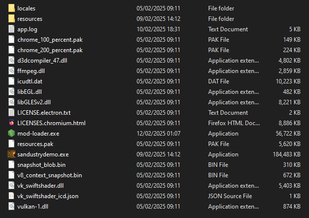

# Sandustry Modloader

Sandustry modloader is a open source tool which allows for easy access to modifying Sandustry with user defined JavaScript mods.

There is support for patches to overwrite sections of the games `bundle.js`, arbitrary JavaScript code execution that can make use of `gameInstance` exposed by the game, and custom API endpoints for interception of network requests and serverside execution of JavaScript.

If you need further help ask **@shadowdev** or **@tomster12** in the Sandustry discord!

## Install Modloader

To install the modloader download `mod-loader.exe` from one of the following links:

- **Latest Stable Release**: https://git.rendezvous.dev/shadowcomputer/sandustry-modloader/-/releases/permalink/latest
- **Latest Dev Builds**: https://git.rendezvous.dev/shadowcomputer/sandustry-modloader/-/artifacts

Then place the exe alongside `sandustrydemo.exe` in your steam install location:



## Downloading Mods

When you first run `mod-loader.exe` it will produce a `mods` folder.  
To install mods, copy any `mod.js` file into this folder.  
This should be enough for them to work!

## Creating Mods

This guide is up to date as of **1.2.0**.  

Some examples are provided [here](https://git.rendezvous.dev/shadowcomputer/sandustry-modloader/-/tree/main/examples?ref_type=heads), showing how to use the patches, the **api** endpoints, and perform arbitrary code execution.

Patches allow you to overwrite sections of the bundle.js. Currently we support **process** and **regex** type patches and can be be defined under `exports.patches = []`.

A `regex` patch finds instances of `pattern`, replaces it with `replace`, and expects `expectedMatches`:

```js
export.patches = [
    {
        "type": "regex",
        "pattern": 'description:"Unlocks Conveyor Belts and Launchers.",cost:50',
        "replace": 'description:"Unlocks Conveyor Belts and Launchers.",cost:1',
        "expectedMatches": 1
    }
]
```

A `process` patch defines a function that takes in the entire `bundle.js` in its current state, and outputs a new processed `bundle.js`:

```js
export.patches = [
    {
        "type": "process",
        func: (data) => {
            // Do something here
            return data;
        }
    }
]
```

An API endpoint allows you to either define your own endpoints (to perform arbitrary functions, and return arbitrary data) or to add interceptions to return your own files. These must be defined inside `exports.api = {}`.

The following adds an endpoint at `test/mod` that return `"Hello World!"`:

```js
exports.api = {
    "test/mod": {
        requiresBaseResponse: false,
        getFinalResponse: async ({ interceptionId, request, responseHeaders, response,resourceType }) => {
            let bodyData = "Hello World!";
            let contentType = "text/plain";
            return { bodyData, contentType };
        }
    }
}
```

This can access in mod code:

```js
const response = await fetch("test/mod");
```

Alternatively you could intercept requests to certain files. This could allow you to process what is returned, or even intercept and return your own files:

```js
exports.api = {
    ".png": {
        requiresBaseResponse: true,
        getFinalResponse: async ({  interceptionId, request, baseResponse, responseHeaders, resourceType }) => {
            log(`Intercepted PNG request: ${request.url}`);
            return { body: baseResponse.body, contentType: "image/png" };
        }
    }
}
```

We also define a series of hooks for mods to use.

`exports.onMenuLoaded` and `exports.onGameLoaded` are both called when the menu or the game is loaded, respectively.

During these we guarantee that `gameInstance` points at the underlying `__debug` object exposed by the game when in debug mode. This is what allows you to access and modify the game.

```js
exports.onGameLoaded = function () {
  console.log(`test-mod: game loaded, game version: ${gameInstance.state.store.version}`);
};
```

## Build Modloader

Alternatively you can build the `mod-loader.exe` yourself. The source code is readily available to clone from this repo:

```bash
git clone https://git.rendezvous.dev/shadowcomputer/sandustry-modloader.git
```

Then ensure you have nodejs installed ([download](https://nodejs.org/en/download)), and perform the following inside the modloader folder:

```bash
npm i -g pkg
pkg . --targets win --output "mod-loader.exe"
```

This will produce a `mod-loader.exe` file which you can put in the steam folder as shown above.
